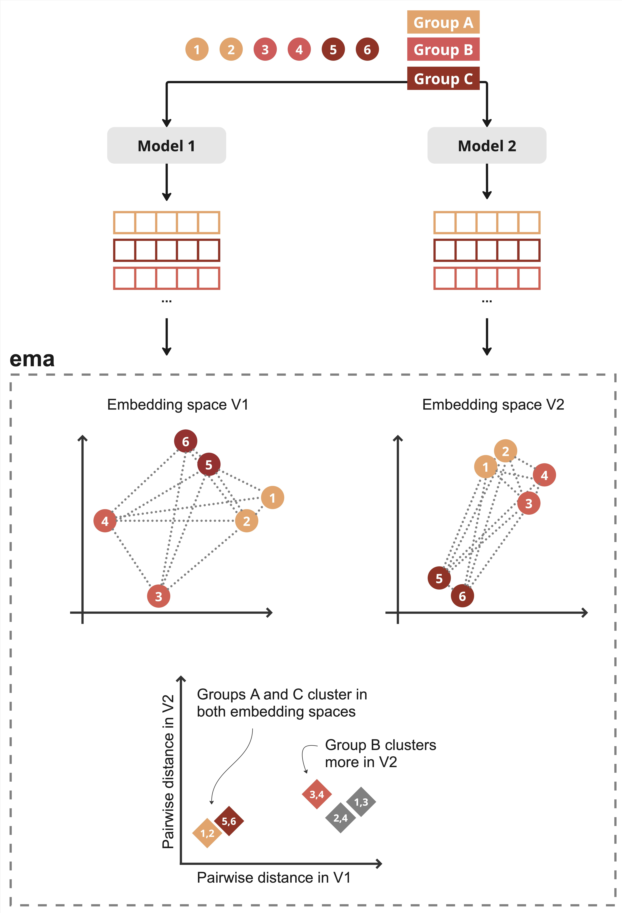

# ema-tool

ema-tool is a Python library designed to facilitate the initial **comparison** of diverse **embedding spaces** in biomedical data. By incorporating **user-defined metadata** on the natural grouping of data points, ema-tool enables users to compare global statistics and understand the differences in clustering of natural groupings across different embedding spaces.


## Overview

- **[Features](#features)**
- **[Installation](#installation)**
- **[Colab Notebook Examples](#colab-notebook-examples)**
- **[Links to Embedding Scripts](#links-to-embedding-scripts)**
- **[License](#license)**

## Features

Given a set of samples and metadata, and at least two embedding spaces, the **ema-tool** provides visualisations to compare the following aspects of the embedding spaces:

- **Unsupervised Clusters**: ema-tool provides a simple interface to cluster samples in the embedding space using the KMeans algorithm and compare against user-defined metadata.
- **Dimensionality Reduction**: ema-tool allows users to reduce the dimensionality of the embedding space using PCA, t-SNE, or UMAP.
- **Pairwise Distances**: ema-tool computes pairwise distances between samples in the embedding space. Different distance metrics are available, including Euclidean, Cosine, and Mahalanobis.

The following figure provides an overview of the ema-tool workflow:




## Installation

You can install the ema library through pip, or access examples locally by cloning the github repo.

### Installing the ema library
```
pip install ema-emb
```

### Cloning the ema repo
```
git clone https://github/pia-francesca/ema

cd ema                         # enter project directory
pip3 install .                 # install dependencies
jupyter lab colab_notebooks    # open notebook examples in jupyter for local exploration
```

## Colab Notebook Example

An example of how to use the ema-tool library is provided in the following colab notebook: 

[](https://colab.research.google.com/github/pia-francesca/ema/blob/main/colab_notebooks/ema_tool_application_example.ipynb)


## Links to Embedding Scripts

To allow a flexible use, ema-tool does not include the scripts for generating the embeddings. However, here are some links to external scripts for generating protein embeddings from fasta files using the following models:

- [ESM model](https://github.com/facebookresearch/esm?tab=readme-ov-file#compute-embeddings-in-bulk-from-fasta-)
- [ProtT5 model](https://github.com/agemagician/ProtTrans#-quick-start)

## Contact 

If you have any questions or suggestions, please feel free to reach out to the authors: francesca.risom@hpi.de.

## License
This project is licensed under the MIT License - see the [LICENSE](LICENSE) file for details.